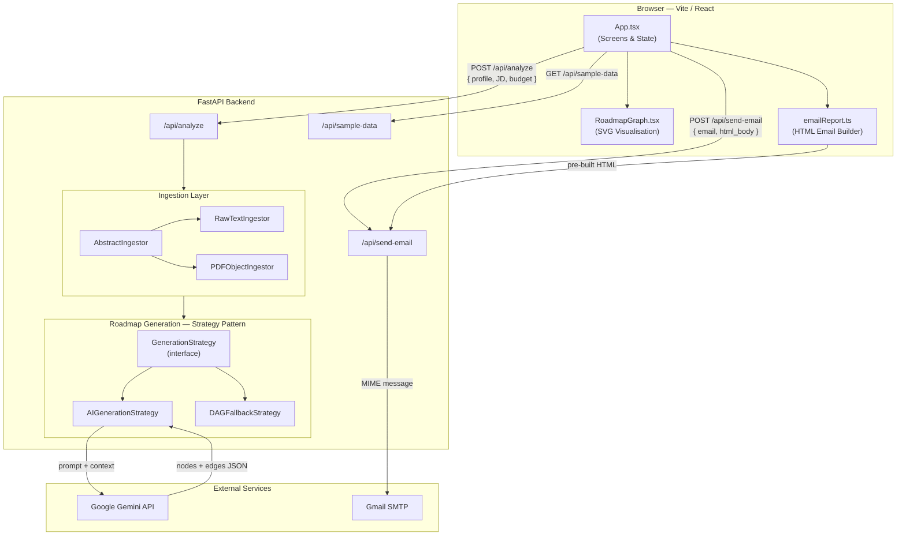
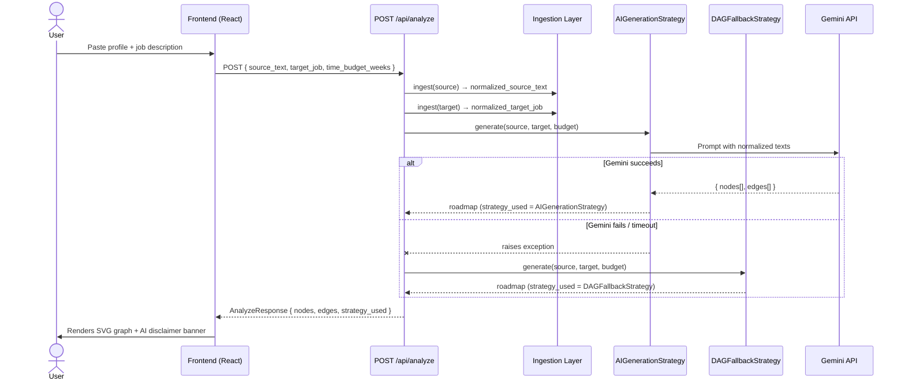
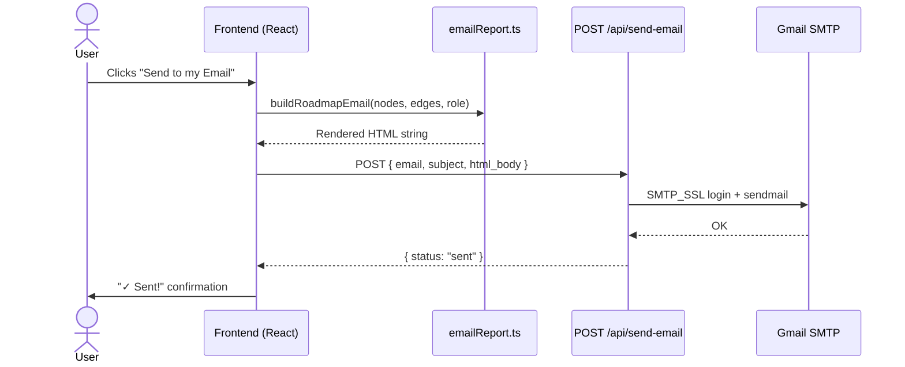

# Skill-Bridge Design Document

## Overview

Skill-Bridge is a career navigation platform built for the reality that **AI-driven technology teams — especially in cybersecurity — move faster than traditional hiring pipelines**. When a team is building AI runtime security infrastructure, there is rarely a candidate who checks every box in the job description. The real question is: *how close is this person, and what is the shortest path forward?*

Skill-Bridge accepts a learner's current profile and a target job description, then generates a dependency-aware visual roadmap that answers exactly that question. It is designed with security roles in mind — the sample data ships with profiles transitioning into **Cloud Security Engineer** and **AI Security Operations** roles, directly mirroring the FY26 IT hiring focus.

---

## Scoring Pillar Alignment

### 1. Problem Understanding
Fast-moving cybersecurity teams — like those building AI runtime security at Palo Alto Networks — hire for potential as much as for existing credentials. A candidate who is 70% of the way to a Cloud Security Engineer role is far more valuable than a candidate with no path forward, but current hiring tooling offers no way to measure or visualise that gap.

Skill-Bridge solves this from the candidate's perspective: given *where I am* (resume/profile) and *where the role needs me* (job description), what is the ordered, dependency-aware path forward?

The key insight is that skills have prerequisites — you cannot learn Kubernetes before Docker, and you cannot do threat modelling without networking fundamentals. Most career tools ignore this ordering. Skill-Bridge models it explicitly as a directed acyclic graph.

### 2. Technical Rigor
The system is built in two decoupled layers:

**Component 1 — Ingestion Layer**
Converts varied input formats into normalized text for the roadmap engine.
- `AbstractIngestor` defines the contract.
- `RawTextIngestor` normalizes pasted profile/JD text.
- `PDFObjectIngestor` extracts and cleans text from uploaded PDF files.

New input sources can be added as subclasses without touching any API route.

**Component 2 — Roadmap Generation (Strategy Pattern)**
The strategy pattern allows the app to switch algorithms transparently:
- `AIGenerationStrategy` — sends normalized source+target text to Gemini, which identifies missing skills and infers prerequisite dependency edges.
- `DAGFallbackStrategy` — a deterministic fallback using a curated in-memory skill dependency map, used when the AI call fails.

The API always returns the same `{ nodes, edges }` shape regardless of which strategy ran.

**Fallback Trapdoor**
`/api/analyze` attempts AI generation first. On any failure it silently falls back to the DAG strategy, keeping the experience stable.

**Zero-Retention**
The backend is stateless by design. No resumes, JDs, or profile text are persisted to a database. All processing happens in-memory within the request lifecycle.

---

## Architecture Diagrams

### Component Architecture

---

### Request Flow — Roadmap Analysis

---

### Request Flow — Email Report

---

### 3. Creativity
- **Hover tooltip graph** — nodes reveal rationale and resources on hover without cluttering the base view.
- **Email report** — users can send their roadmap to any email address as a formatted HTML report, built entirely on the frontend.
- **Dynamic Next Step banner** — the system identifies the true root node (first skill with no prerequisites) and surfaces it as the recommended next action, not just the first item in the list.
- **Dual ingestion** — raw text and PDF uploads let the same flow handle both structured resumes and pasted summaries.

### 4. Prototype Quality
- Full-stack: FastAPI backend + Vite/React frontend.
- Live API docs at `/docs` (Swagger UI).
- Sample profiles and job descriptions included for immediate demo use.
- Filter bar to search the graph by skill, resource, or rationale.
- Responsive layout with smooth animations.

### 5. Responsible AI

**Disclosure & Transparency**
- AI usage is declared in both `README.md` and a visible **in-product disclaimer banner** shown on every generated roadmap: *"This roadmap is AI-generated and may reflect biases in training data. It is a starting point — not professional career advice."* Judges can see this live during the demo.
- The `strategy_used` meta-pill on the result UI tells the user in real time whether their roadmap was generated by the AI or the deterministic fallback.

**Bias Awareness**
- LLMs can reflect biases in training data — for example, consistently recommending a cloud vendor's ecosystem or over-weighting certain educational credentials. The `rationale` field on every node exposes the AI's reasoning, giving users the ability to challenge or dismiss any suggestion that seems skewed.
- The deterministic DAG fallback uses a manually curated dependency map that is fully inspectable in `dag_fallback_strategy.py`, providing a bias-free baseline.

**Input Guardrails (Prompt Injection Defence)**
- `source_text` is capped at **25 000 characters** and `target_job` at **10 000 characters** via Pydantic `max_length` constraints (see `models.py`). This prevents prompt-stuffing and runaway API cost attacks.
- Base64 PDF payloads are validated with `binascii.Error` catching before BytesIO is handed to PyPDF, preventing malformed binary blobs from reaching the model.

**Consent & Data Minimisation**
- The system is **zero-retention by design**: no profile text, job descriptions, or personal data are written to a database or log file. Everything is processed in-memory within the HTTP request lifecycle.
- Users explicitly paste or upload their own data — there is no background scraping, clipboard access, or third-party data enrichment.

**Graceful Degradation**
- When AI output is unavailable or unreliable, a deterministic DAG provides a safe, explainable fallback. The user experience is never broken by an AI failure.

**Explainability**
- Every generated node includes a `rationale` field. This ensures the AI is not a black box — users can read, verify, or reject each recommendation before acting on it.

**Production Roadmap (Responsible AI Next Steps)**
- Add output filtering to detect and suppress discriminatory skill suggestions (e.g., age-related or credential-exclusive gatekeeping).
- Rate-limit the `/api/analyze` endpoint per IP to prevent abuse.
- Log `strategy_used` metrics (AI vs DAG ratio) for drift monitoring.

---

## Tradeoffs

| Decision | Rationale |
|---|---|
| In-memory DAG fallback instead of a graph DB | Avoids infra dependency; sufficient for a demo scope |
| No authentication | Out of scope for a prototype; would be first addition in production |
| Text-only PDF extraction (no OCR) | PyPDF covers text-layer PDFs; OCR adds significant complexity |
| AI edges can be incomplete | Documented limitation; mitigated by the rationale field and human review |
